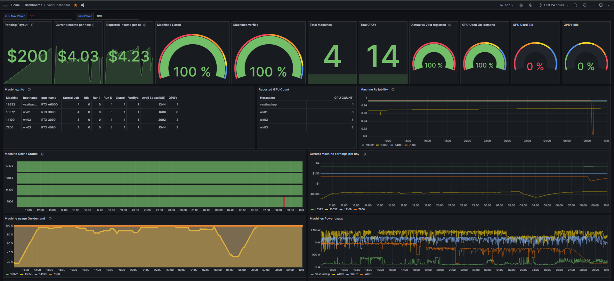
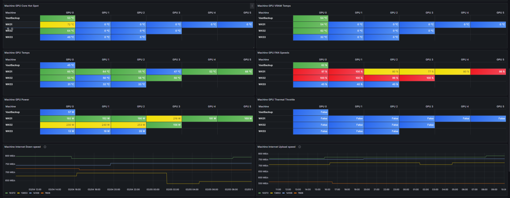
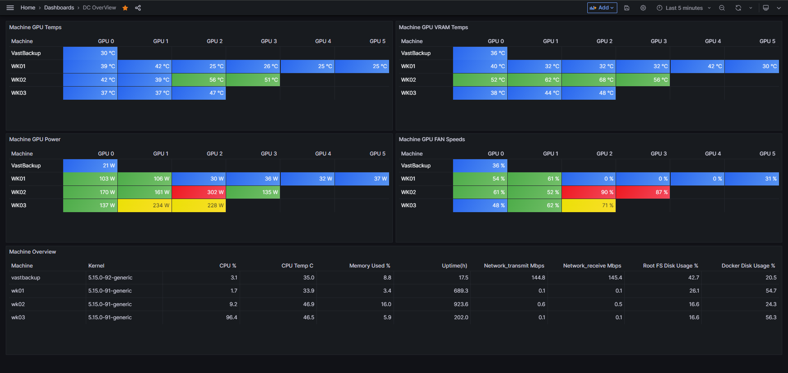

# DC Overview - GPU Datacenter Monitoring Suite

[](https://pypi.org/project/dc-overview/)
[](https://opensource.org/licenses/MIT)

Complete monitoring solution for GPU datacenters with Prometheus, Grafana, and AI-powered insights.


*Real-time monitoring of your GPU fleet - earnings, reliability, temperatures, and more*

---

## 🚀 Quick Start

### One Command Setup ⚡

```bash
pip install dc-overview
sudo dc-overview quickstart
```

**That's it!** Answer a few questions:

```
╭──────────────────────────────────────────────────╮
│           DC Overview - Quick Setup              │
╰──────────────────────────────────────────────────╯

Detected: gpu-server (192.168.1.100) with 4 GPUs

Step 1: What is this machine?
  ● GPU Worker (has GPUs to monitor)
  ○ Master Server (monitors other machines)
  ○ Both (has GPUs + monitors others)

Step 2: Installing GPU Monitoring
  ✓ node_exporter installed (port 9100)
  ✓ dc-exporter installed (port 9500)

Step 3: Vast.ai Integration (Optional)
  Are you a Vast.ai provider? [y/N]: 

✓ Setup Complete!
```

### What It Does Automatically

| Your Answer | What Gets Installed |
|-------------|---------------------|
| **GPU Worker** | node_exporter, dcgm-exporter, dc-exporter |
| **Master Server** | Prometheus, Grafana + asks to add workers |
| **Both** | All of the above |
| **Vast.ai provider** | vastai-exporter for earnings tracking |

### After Setup

```bash
# Add more machines to monitor
dc-overview add-machine 192.168.1.101 --name gpu-worker-01

# Add machine and install exporters via SSH
dc-overview add-machine 192.168.1.102 --ssh-pass mypassword
```

**What the setup wizard does:**
- Auto-detects if machine has GPUs (suggests worker mode)
- Prompts for Grafana password, ports, Vast.ai API key
- Lets you add worker targets for Prometheus
- Generates docker-compose.yml and prometheus.yml
- Installs systemd services

### Quick Setup with Config File

For faster deployment across many machines:

```bash
mkdir -p ~/.config/dc-overview
```

### Bulk Add Workers

```bash
# Interactive bulk add - paste IPs one per line
dc-overview deploy bulk
```

```
╭──────────────── Bulk Add Workers ────────────────╮
│ Enter workers one per line in format:            │
│ ip,name,user,port (name, user, port optional)    │
│                                                  │
│ Examples:                                        │
│   192.168.1.101                                  │
│   192.168.1.102,gpu-worker-02                    │
│   192.168.1.103,gpu-worker-03,root,22            │
│                                                  │
│ Enter empty line when done.                      │
╰──────────────────────────────────────────────────╯
Worker: 192.168.1.101
  ✓ Added: worker-101 (192.168.1.101)
Worker: 192.168.1.102,gpu-02
  ✓ Added: gpu-02 (192.168.1.102)
Worker: 

Deploy SSH keys to these workers? [Y/n]: y
Enter SSH password (same for all): ********
Deploying SSH key to worker-101 (192.168.1.101)...
✓ SSH key deployed to worker-101
```

### CSV Import

```bash
dc-overview deploy bulk --csv workers.csv
```

**workers.csv:**
```csv
name,ip,ssh_user,ssh_port,ssh_password
gpu-worker-01,192.168.1.101,root,22,mypassword
gpu-worker-02,192.168.1.102,root,22,mypassword
gpu-worker-03,192.168.1.103,root,22,mypassword
```

**~/.config/dc-overview/config.yaml:**
```yaml
mode: worker  # or "master"

exporters:
  node_exporter: true    # CPU, RAM, disk (port 9100)
  dcgm_exporter: true    # NVIDIA GPU metrics (port 9400)
  dc_exporter: true      # VRAM temps (port 9500)
```

**~/.config/dc-overview/targets.yaml** (master only):
```yaml
targets:
  - name: gpu-worker-01
    ip: 192.168.1.101
    ports: [9100, 9400, 9500]

  - name: gpu-worker-02
    ip: 192.168.1.102
    ports: [9100, 9400, 9500]

  - name: gpu-worker-03
    ip: 192.168.1.103
    ports: [9100, 9400, 9500]
```

Then run:
```bash
# On master
dc-overview setup master --non-interactive --install-services

# On workers
dc-overview setup worker --non-interactive --install-services
```

### CLI Commands

```bash
# === DEPLOY (from master - manages entire fleet) ===
dc-overview deploy wizard          # Interactive deployment wizard
dc-overview deploy add             # Add a worker interactively
dc-overview deploy bulk            # Bulk add workers (paste IPs or CSV)
dc-overview deploy list            # List all workers with status
dc-overview deploy install         # Install exporters on all workers
dc-overview deploy install -w wk01 # Install on specific worker
dc-overview deploy ssh-key --generate  # Generate new SSH key
dc-overview deploy scan            # Scan network for workers
dc-overview deploy vast            # Set up Vast.ai exporter
dc-overview deploy vast --status   # Check Vast.ai exporter status

# === SETUP (on individual machines) ===
dc-overview setup master           # Interactive master setup
dc-overview setup worker           # Interactive worker setup
dc-overview setup --non-interactive  # Use config files

# === EXPORTERS (install locally) ===
dc-overview install-exporters      # Install all exporters
dc-overview install-exporters --no-dcgm-exporter  # Skip GPU exporter

# === PROMETHEUS (manage targets) ===
dc-overview add-target 192.168.1.101 --name gpu-worker-01
dc-overview list-targets
dc-overview generate-compose       # Generate docker-compose.yml

# === STATUS ===
dc-overview status                 # Show service status
dc-overview logs -f                # Follow logs
```

---

### Option 2: Docker Compose (Manual)

For those who prefer manual Docker setup:

```bash
git clone https://github.com/cryptolabsza/dc-overview.git
cd dc-overview
cp .env.example .env
nano .env  # Edit with your secrets
docker compose up -d
```

---

## 📊 Architecture

```
┌─────────────────────────────────────────────────────────────────────────────────┐
│                              PRODUCT OVERVIEW                                   │
├─────────────────────────────────────────────────────────────────────────────────┤
│                                                                                 │
│  IN-DC STACK (runs in customer datacenter)                                      │
│  ══════════════════════════════════════════                                     │
│                                                                                 │
│  ┌─────────────────┐  ┌─────────────────┐  ┌─────────────────┐                  │
│  │   dc-overview   │  │  ipmi-monitor   │  │   dc-exporter   │                  │
│  │   (Grafana +    │  │  (IPMI/Redfish  │  │  (VRAM temps    │                  │
│  │   Prometheus)   │  │   dashboard)    │  │   exporter)     │                  │
│  └─────────────────┘  └─────────────────┘  └─────────────────┘                  │
│         │                     │                     │                           │
│         └─────────────────────┴─────────────────────┘                           │
│                               │                                                 │
│                    Deployed ON monitoring server                                │
│                    inside the datacenter                                        │
│                                                                                 │
├─────────────────────────────────────────────────────────────────────────────────┤
│                                                                                 │
│  MASTER SERVER         │  GPU WORKERS                                           │
│  ═══════════════       │  ════════════                                          │
│                        │                                                        │
│  • Prometheus (9090)   │  • node_exporter (9100) - CPU, RAM, disk              │
│  • Grafana (3000)      │  • dcgm-exporter (9400) - GPU metrics                 │
│  • Scrapes workers     │  • dc-exporter (9500)   - VRAM temps                  │
│                        │                                                        │
│  1 per datacenter      │  Install on each GPU server                            │
│                                                                                 │
└─────────────────────────────────────────────────────────────────────────────────┘
```

---

## 📁 Configuration Files

### config.yaml (General settings)

```yaml
mode: master  # or "worker"

master:
  prometheus_port: 9090
  grafana_port: 3000
  grafana_password: your-secure-password

exporters:
  node_exporter: true
  dcgm_exporter: true
  dc_exporter: true

vast_api_key: your-vast-api-key  # Optional: for Vast.ai metrics
```

### targets.yaml (Prometheus scrape targets)

```yaml
targets:
  - name: gpu-worker-01
    ip: 192.168.1.101
    ports:
      - 9100  # node_exporter
      - 9400  # dcgm-exporter
      - 9500  # dc-exporter

  - name: gpu-worker-02
    ip: 192.168.1.102
    ports: [9100, 9400, 9500]

  - name: storage-server
    ip: 192.168.1.110
    ports: [9100]  # Only node_exporter (no GPUs)
```

---

## 🖥️ GPU Worker Setup

> ⚠️ **IMPORTANT: Do NOT use Docker containers for exporters on GPU workers!**
>
> - RunPod/Vast.ai do not allow nested containers
> - Containers may interfere with client GPU workloads
> - Native systemd services are lighter and more reliable

Install exporters as native systemd services:

```bash
# Install dc-overview package
pip install dc-overview

# Install exporters (auto-detects GPUs)
sudo dc-overview install-exporters

# Or install individually
sudo dc-overview install-exporters --no-dcgm-exporter  # Skip GPU exporter
```

### What Gets Installed

| Exporter | Port | Metrics |
|----------|------|---------|
| `node_exporter` | 9100 | CPU, RAM, disk, network |
| `dcgm-exporter` | 9400 | GPU utilization, temp, memory, power |
| `dc-exporter` | 9500 | VRAM temp, hotspot temp, fan speed |

### Verify Installation

```bash
# Check service status
dc-overview status

# Or manually
systemctl status node_exporter dcgm-exporter dc-exporter

# Test metrics endpoints
curl http://localhost:9100/metrics | head
curl http://localhost:9400/metrics | head
curl http://localhost:9500/metrics | head
```

---

## 🖥️ Master Server Setup

The master server runs Prometheus and Grafana to collect metrics from all workers.

```bash
# Install and setup
pip install dc-overview
dc-overview setup master --install-services

# Generate docker-compose.yml
dc-overview generate-compose

# Start services
docker compose up -d
```

### Add Worker Targets

```bash
# Add workers to Prometheus
dc-overview add-target 192.168.1.101 --name gpu-worker-01
dc-overview add-target 192.168.1.102 --name gpu-worker-02
dc-overview add-target 192.168.1.103 --name gpu-worker-03

# View configured targets
dc-overview list-targets

# Reload Prometheus to pick up changes
docker exec prometheus kill -HUP 1
```

### Access Dashboards

- **Grafana**: http://localhost:3000 (default: admin / your-password)
- **Prometheus**: http://localhost:9090 (internal only)

---

## 💰 Vast.ai Integration (For Providers)

If you're a Vast.ai provider, add the Vast.ai exporter to monitor:
- **Earnings** - Daily, weekly, monthly income
- **Reliability score** - Uptime percentage
- **Machine status** - Online/offline, utilization
- **Rental history** - Current and past rentals

```bash
# Set up interactively
dc-overview deploy vast

# Or with API key directly
dc-overview deploy vast --api-key YOUR_VAST_API_KEY

# Check status
dc-overview deploy vast --status
```

**Get your API key from:** https://cloud.vast.ai/account/

The wizard will automatically:
- Start the `vastai-exporter` Docker container
- Add it to your Prometheus targets
- Expose metrics on port 8622

---

## 🔒 Security: Nginx + SSL

For production deployments, put Grafana behind Nginx with SSL:

```bash
# Install Nginx and Certbot
apt install -y nginx certbot python3-certbot-nginx

# Get SSL certificate
certbot --nginx -d grafana.yourdomain.com
```

Nginx config (`/etc/nginx/sites-available/grafana`):
```nginx
server {
    listen 443 ssl;
    server_name grafana.yourdomain.com;

    location / {
        proxy_pass http://127.0.0.1:3000;
        proxy_set_header Host $host;
        proxy_set_header X-Real-IP $remote_addr;
        
        # WebSocket support for Grafana Live
        proxy_http_version 1.1;
        proxy_set_header Upgrade $http_upgrade;
        proxy_set_header Connection "upgrade";
    }
}
```

> ⚠️ **Never expose Prometheus publicly** - it has no authentication. Access via internal network or SSH tunnel only.

---

## 📊 Port Reference

### Master Server

| Port | Service | Access |
|------|---------|--------|
| 3000 | Grafana | Public (with auth) |
| 9090 | Prometheus | **Internal only** |
| 8622 | vastai-exporter | Internal |

### GPU Workers (Exporters)

| Port | Service | Scraped By |
|------|---------|------------|
| 9100 | node_exporter | Prometheus |
| 9400 | dcgm-exporter | Prometheus |
| 9500 | dc-exporter | Prometheus |

---

## 🔧 Supported GPUs (dc-exporter)

| GPU Type | VRAM Temp | Hotspot Temp | Fan Speed | Method |
|----------|-----------|--------------|-----------|--------|
| A100/H100 (Datacenter) | ✅ | ✅ | N/A* | NVML API |
| RTX 4090/4080/4070 | ✅ | ✅ | ✅ | PCIe BAR |
| RTX 3090/3080/3070 | ✅ | ✅ | ✅ | PCIe BAR |
| RTX A6000/A5000 | ✅ | ✅ | ✅ | NVML API |

\* A100-SXM4 and H100 use chassis cooling, no per-GPU fan.

---

## 📈 Dashboard Gallery

### GPU Temperature Monitoring

Monitor VRAM temperatures, hotspot temps, fan speeds, and thermal throttling.



### Vast.ai Provider Dashboard

Track earnings, reliability, utilization for Vast.ai providers.



### System Metrics (Node Exporter)

CPU, memory, disk I/O, network throughput.


---

## 🔍 Troubleshooting

### Prometheus targets showing "down"

```bash
# Check from inside Prometheus container
docker exec prometheus wget -q -O- http://192.168.1.101:9100/metrics | head

# Common issues:
# - Using localhost instead of actual IP (containers can't reach host via localhost)
# - Firewall blocking ports
# - Exporter service not running
```

### Exporter not starting

```bash
# Check service status
sudo systemctl status node_exporter

# View logs
sudo journalctl -u node_exporter -f

# Common issues:
# - Port already in use
# - Missing dependencies (dcgm for dcgm-exporter)
```

### Can't access Grafana

```bash
# Check if container is running
docker ps | grep grafana

# Check logs
docker logs grafana

# Verify port is listening
ss -tlnp | grep 3000
```

---

## 🔗 Links

- **PyPI**: [pypi.org/project/dc-overview](https://pypi.org/project/dc-overview/)
- **GitHub**: [github.com/cryptolabsza/dc-overview](https://github.com/cryptolabsza/dc-overview)
- **dc-exporter releases**: [github.com/cryptolabsza/dc-exporter/releases](https://github.com/cryptolabsza/dc-exporter/releases)
- **Discord**: [Join our community](https://discord.gg/7yeHdf5BuC)

---

## 📜 License

MIT License - see [LICENSE](LICENSE) for details.

---

<p align="center">
  Made with ❤️ by <a href="https://cryptolabs.co.za">CryptoLabs</a>
</p>
